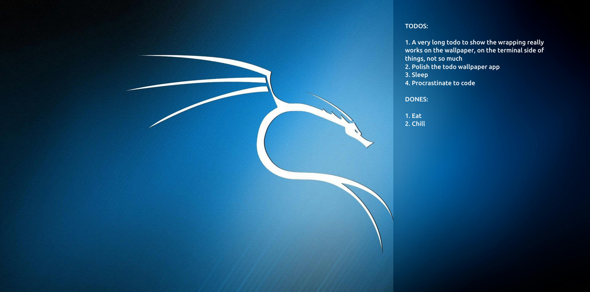
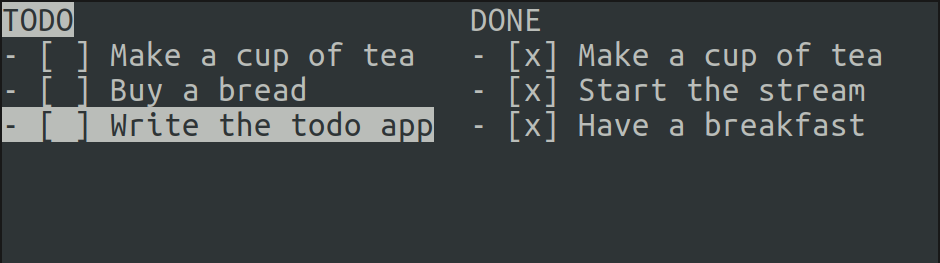

# todo-wall

Interactive terminal todo app in rust which also creates a todo wallpaper for you.

This is meant to be mainly used on GNOME desktops since desktop widgets are not around. It would conveniently provide a glance into one's day plan at one look.

### Desktop



### Terminal



## Quick Start

```console
$ cargo run --release
```

## Controls

|Keys|Description|
|---|---|
|<kbd>k</kbd>, <kbd>j</kbd>|Move cursor up and down|
|<kbd>Shift+K</kbd>, <kbd>Shift+J</kbd>|Drag the current item up and down|
|<kbd>g</kbd>, <kbd>G</kbd> | Jump to the start, end of the current item list|
|<kbd>r</kbd>|Rename the current item|
|<kbd>i</kbd>|Insert a new item|
|<kbd>e</kbd>|Edit an existing item|
|<kbd>d</kbd>|Delete the current list item|
|<kbd>q</kbd>|Quit|
|<kbd>TAB</kbd>|Switch between the TODO and DONE panels|
|<kbd>Enter</kbd>|Perform an action on the highlighted UI element|
